## Introduction
MINOTAUR is an R package for identifying and visualizing multivariate outliers. It is tailored towards researchers seeking to identify genetic loci that are under natural selection or loci putative underlying phenotypic traits. Methodologies targeting these answers typically use whole-genome sequencing or reduced marker datasets from population-level sampling and infer one or more meaningful statistics, including statistics for population genetic analyses, genetic-environment associations, and genome-wide associations. In effect, generating these statistics from loci spread throughout a genome allows a geneticist to scan for loci or regions of the genome where a statistic behaves aberantly in comparison with the genome-wide background. 

Studies are generating an increasing number of statistics across one or more broad inferential classes. A common practice thus far has been to look across statistics to identify candidate genes for further investigation, essentially enriching for loci with outlier values found under several statistics. The largely *ad hoc* nature of this decision making process and the fact that certain statistics enjoy more power under particular evolutionary scenarios or sampling designs collectively indicate that these methods can be biased and can suffer from high error rates. MINOTAUR was designed to help identify candidate genomic loci or regions by leveraging values from several statistics to identify outliers in multi-dimensional space. The core goal of this package is to introduce multivariate distance measures that can be used in conjunction with genomic scan data. Moreover, MINOTAUR aids in outlier visualization using the R ShinyDashboard interface, proving an intuitve, interactive graphical user interface (GUI) environment to explore univariate and multivariate data.

## Getting Started
MINOTAUR can be installed from [CRAN](http://cran.rstudio.com/package=MINOTAUR) (pending), or from [GitHub](http://github.com/NESCent/MINOTAUR), if the latest development version is desired:
  
```{r eval=FALSE}
install.packages('MINOTAUR')
#' to install the development version, run:
#' require(devtools)
#' install_github('NESCent/MINOTAUR', build_vignettes=TRUE)
```

Please use the following citation when reporting work that used MINOTAUR (final citation and link to paper will be included upon publication):
  
Robert Verity, Caitlin Collins, Daren C. Card, Sara M. Schaal, Liuyang Wang, & Katie E. Lotterhos. (2017) MINOTAUR: an R package for visualizing and calculating multivariate outliers in genomic datasets. *Molecular Ecology Resources* 17(1): 33-43. [doi:10.1111/1755-0998.12579](https://dx.doi.org/10.1111/1755-0998.12579)

## Workflow Overview
The MINOTAUR package is broken into two parts:
  
1. Six functions that calculate composite measures using two or more univariate variables: `Mahalanobis`, `harmonicDist`, `kernelDist`, `neighborDist`, `CSS`, and `DCMS`. The composite measures are meant to supplement existing R functions from other packages that infer outliers using multivariate composite statistics or by combining p-values from multiple tests.

2. An R Shiny GUI that can be used to visualize the distributions of individual statistics separately and together, and to help produce publication-quality figures.

An expanded example with code is included below, but a basic workflow leveraging MINOTAUR is as follows:

1. Loading Data: Data is loaded into the MINOTAUR GUI from an external data format (i.e., tab-delimited or comma-delimited files). Users can upload their own data or explore the GUI using one of the three sample datasets provided in the MINOTAUR package (see below).

2. Formatting Data: Users can format data by indicating the positional and grouping (e.g., chromosome) variables, by removing unimportant variables (e.g., metadata), and by removing missing data.

3. Outlier Calculation: Multivariate outliers can be inferred both within the MINOTAUR GUI and using stand-alone R functions provided as part of the MINOTAUR package or from other, existing packages.

4. Plotting: The plotting functions in the MINOTAUR GUI enables the user to further investigate their data and produce publication-quality figures. Plots can be produced on either the entire data set before outlier calcuation, a subset of the original dataframe, and/or once the dataset has been filtered to only multivariate outliers. 

## Multivariate Statistics Available in MINOTAUR
The MINOTAUR package includes six functions for inferring multivariate distances and densities based on univariate statistics or p-values. In cases where only statistics are available (i.e., no associated p-values), the function `stat_to_pvalue()` will convert statistics to p-values based on fractional ranks.
  
1. `Mahalanobis()`: The Mahalanobis distance is a multi-dimensional measure of the number of standard deviations that a point lies from the mean of the distribution. More information is available in Verity et al. (2017) and Lotterhos et al. (2017).

2. `harmonicDist()`: The harmonic mean distance of an observation refers to the harmonic mean of the distance from this observation to all other observations. More information is available in Verity et al. (2017) and Lotterhos et al. (2017).

3. `kernelDist()`: The kernel density refers to the density of observations within one bandwidth distance of each observation in a dataset. A second function, `kernelDeviance()`, can be used to determine the optimal bandwidth given the data using maximum likelihood. More information is available in Verity et al. (2017) and Lotterhos et al. (2017).

4. `neighborDist()`: The nearest neighbor distance of an observation is the minimum distance between this observation and any other observation. More information is available in Verity et al. (2017) and Lotterhos et al. (2017).

5. `CSS()`: The composite selection signals approach combines p-values using Stouffer's method, which assumes independence among the statistics being summarized. Statistics are converted to fractional ranks, which are then converted to Z-values, and the mean Z-score for each locus is used to identify a p-value based on a normal distribution. The CSS statistic is the -log10 of the p-value. See Randhawa et al. (2014; 2015) and Lotterhos et al. (2017) for more details.

6. `DCMS()`: The De-correlated composite of multiple signals approach is similar to CSS, but does not assume independence among the univariate statistics. A weighting factor based upon the genome-wide correlation between all pairwise univariate statistics is applied to each locus. Therefore, highly correlated statistics contribute less to the calculation. For example, if two statistics are perfectly correlated and a third statistic is uncorrelated with the first two, the respective weights will be (½, ½, 1). See Ma et al. (2015) and Lotterhos et al. (2017) for more details.

## Sample Data Available from MINOTAUR
Four example datasets have been included with the MINOTAUR package:

1. `HumanGWAS`: An example of output returned from a human Genome-Wide Association Study (GWAS).

2. `TwoRefSim`: A dataset contains population genetic data simulated under a model of expansion from two refugia.

3. `NonParametricInverse`: A simple, nonparametric two-variable dataset with an inverse relationship between variables.

4. `NonParametricMultimodal`: A simple, nonparametric two-variable dataset that is highly multimodal.

More information about these datasets can be obtained from the MINOTAUR mauscript and by issuing the following command in R:

```{r eval=FALSE}
# format = ?<dataset>
# example with 'HumanGWAS':
?HumanGWAS
```

## Plotting Options in MINOTAUR
MINOTAUR includes three plotting options for visualizing univariate and multivariate measures.

1. `1D Histogram`

2. `2D Scatterplot`

3. `Linear Manhattan Plot`

The latter two plots utilize a novel plotting function that produces binned data plots, which are useful for plotting large datasets, with user-defined outlier measurements overlaid as individual points. The MINOTAUR developers are also working to implement additional visualization tools, which will be released periodically.

## Specific Examples

### Calculating Mulitvariate Statistics using Stand-alone Functions
While the four MINOTAUR multivariate statistics can be calculated within the MINOTAUR GUI, users may sometimes wish to calculate them outside of the GUI. Users would normally load their own dataframe from an CSV/TSV or Rdata file. Here data will be created using the `rnorm` function.

```{r warning=FALSE, message=FALSE, fig.width=7, fig.height=7}
# load MINOTAUR
library(MINOTAUR)

# CREATE DATASET
# set the number of observations (e.g., loci)
observations <- 1000
# set arbitrary observation IDs using seq
# (to mimic positional metadata normally found in genome-wide data)
obsID <- seq(1, observations, by=1)
# generate distributions using rnorm for 5 variables (e.g., statistics)
var1 <- rnorm(observations)
var2 <- rnorm(observations)
var3 <- rnorm(observations)
var4 <- rnorm(observations)
var5 <- rnorm(observations)
# bind variables into a data frame
allVar <- cbind(obsID, var1, var2, var3, var4, var5)
```

Once the dataset is created, we can run five of the composite measures, with each having essentially the same
arguments available.

```{r warning=FALSE, message=FALSE, fig.width=7, fig.height=7}
# CALCULATE MULTIVARIATE MEASURES
# set the columns to use for multivariate inference
columns <- 2:6
# run each multivariate function
# note that these functions cannot accommodate any missing data
# and that arguments are shared between all functions
# Mahalanobis
Md <- Mahalanobis(dfv=allVar, column.nums=columns)
# Harmonic mean distnace
Hd <- harmonicDist(allVar, columns)
# Nearest neighbor distance
Nd <- neighborDist(allVar, columns)
# Kernel density
# first determine the optimal bandwidth based on the data
# create a range of bandwidths
bw <- c(seq(0.01,0.1,by=0.01),seq(0.2,1,by=0.1))
# determine the optimal bandwidth
Kd.ML <- kernelDeviance(allVar, columns, bandwidth=bw)
bw.best <- bw[which(Kd.ML==max(Kd.ML))[1]]
# calculate the kernel density
Kd <- kernelDist(allVar, columns, bandwidth=bw.best)
# Composite Selection Signals (CSS)
# test statistics are autmoatically converted to franctional ranks (stat_to_pvalue)
# CSS does not take covariance into account (i.e., no S argument)
css <- CSS(allVar, columns)
```

The sixth composite measure, DCMS, relies on p-values and some additional work is needed.

```{r warning=FALSE, message=FALSE, fig.width=7, fig.height=7}
# convert the test statistics to p-values based on fractional ranks
# alternatively, you can use p-values based on a statistical test of your data
allVar_pvalue <- stat_to_pvalue(allVar, columns)
# recombine the data.frame with identifiers and nice column names
allVar_pvalue <- cbind(allVar[,1], allVar_pvalue)
names(allVar_pvalue) <- c(names(allVar)[1], paste0(names(allVar)[-1], "_pvalue"))
# calculate the DCMS values
# note that a matrix of test statistics and p-values are both necessary (can be in same data.frame)
# if test statistics are not available, the p-value matrix can be passed
# to the dfv argument if the p-values are well calibrated
dcms <- DCMS(dfv=allVar, column.nums=columns, dfp=allVar_pvalue, column.nums.p=columns)
```

Finally, it is easy to visualize the distribution of each of these composite measures and use appropriate
methods to isolate outliers in these distributions, which are likely to be enriched for loci under
selection.

```{r warning=FALSE, message=FALSE, fig.width=7, fig.height=7}
# VIEW RESULTS
# plot a histogram of the multivariate statistics
hist(Md, breaks=50, xlab="Mahalanobis distance", main="Histogram of Mahalanobis distance")
hist(Hd, breaks=50, xlab="Harmonic mean distance", main="Histogram of Harmonic mean distance")
hist(Nd, breaks=50, xlab="Nearest neighbor distance", main="Histogram of Nearest neighbor distance")
hist(Kd, breaks=50, xlab="Kernel density", main="Histogram of Kernel density")
hist(css, breaks=50, xlab=-log10 pvalue, main="Histogram of CSS statistic")
hist(dcms, breaks=50, xlab="DCMS", main="Histogram of DCMS statistic")
```

By default, MINOTAUR uses the `cov` function in R to calculate the covariance matrix. One can also 
alculate their own custom covariance matrix using alternative R functions. Here is a brief example
using the *Minimum Covariance Determinant (MCD)* implemented in `rrcovNA`

```{r warning=FALSE, message=FALSE, fig.width=7, fig.height=7}
# install/load rrcovNA
install.packages("rrcovNA")
library("rrcovNA")

# calculate the MCD covariance matrix (ignoring obsID)
MCD.covmat <- CovNAMcd(allVar[,-1])@cov

# using the MCD covariance matrix by passing it to the S argument
# in this example, we're using the Mahalanobis function, but this will work
# with all MINOTAUR composite measure functions except CSS
Md_MCD <- Mahalanobis(dfv=allVar, column.nums=columns, S=MCD.covmat)

# take a quick look at the results
# not much of a difference with this randomly-generated data
hist(Md_MCD, breaks=50, xlab="Mahalanobis distance", main="Histogram of Mahalanobis distance")
```

### Calculating and Visualizing Multivariate Distributions using the MINOTAUR GUI

##### Initiating the MINOTAUR GUI
The above workflow can also be performed within the MINOTAUR GUI, which provides much richer visualization of multivariate distance distributions and outliers. To initiate the MINOTAUR GUI, type the following commands into R.

```{r eval=FALSE}
library('MINOTAUR')
MINOTAUR()
```

The MINOTAUR GUI will then open in your default internet browser.

##### Overview
The **Welcome** page will greet you and includes a brief overview on the package and some basic navigation instructions.

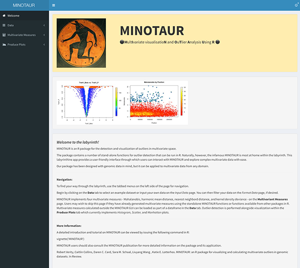


Along the left-hand side of the window is a series of tabs allowing the user to move through the MINOTAUR menus. The **Data** tab is used to load and format data. The **Multivariate Measures** tab is used to calculate multivariate measures using the data. Finally, the **Produce Plots** tab provides a series of useful plots for visualizing both univariate and multivariate distributions and outliers. Throughout this example, these menus will appear in **bold** and any submenus will appear in *italics*.


##### Inputing and Filtering Data

To get started, data must first be leaded into the GUI. Clicking on **Data** and *Input Data* will take the user to a menu for this. Users can select between using example data or uploading their own data from text files or an Rdata object. For this example, we will be using the 'Human GWAS' example dataset that is described above.

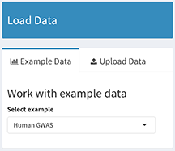


When any dataset is selected or uploaded, the number of rows and columns will be reported to the right, above interactive data and summary tables.

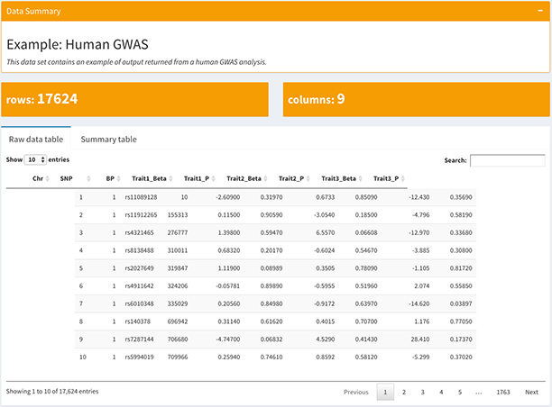


Before proceeding to outlier detection, we will first do some data formatting in the *Format Data* submenu. This allows the user to first set position (i.e., bp) and grouping (i.e., chromosome) variables, which is useful for later plotting. For this dataset, the position variable is 'BP' and the grouping variable is 'Chr'.

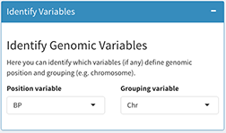


Users can also subset data a number of ways. First, one can decide which data variables (columns) to carry forward in the GUI by unselecting the 'Use all remaining variables' checkbox. The user can add variables and decide whether to retain or remove them from the dataset. Users also have the option of removing missing data in the form of 'NA', 'NaN', and '+/-Inf'. Missing data is prohibited in all MINOTAUR multivariate functions, so care should be taken to use these options and any other means to eliminate missing data. In this example, we will keep only the beta-distributed trait measurements ('TraitN_Beta') and will remove any forms of missing data (check all boxes).

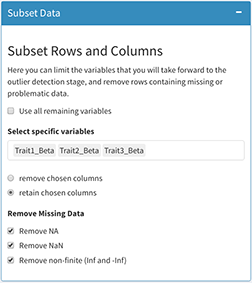


To the right, some useful information is displayed. Along the top is a plot of the breakdown of data across grouping variables (e.g., the number of SNPs on each chromosome; currently under construction). Along the bottom is a view of the final data table with variables and missing data excluded.

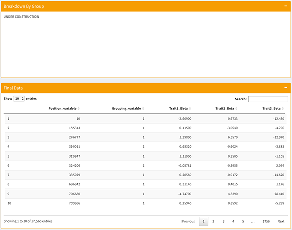


##### Calculating Multivariate Measurements

The next major step in the MINOTAUR workflow is to calculate multivariate composite measures. By clicking on **Multivariate Measures** and *Calculate* the user is brought to a series of menus. Along the left side is a tabbed menu for generating and summarizing any multivariate measures. The summary table will appear blank at first, and multivariate measures can be added using either the 'Distance-Based' or 'Density-Based' tabs, which reflect the general manner multivariate measurements are made.

Under the 'Distance-Based' tab, the user has the ability to use the Mahalanobis, Harmonic Mean, and Nearest Neighbor distances. For each, the user should select the three retained variables ('TraitN_Beta') and the desired distance measurement. Upon clicking the 'Calculate!' button, the distance measure is calculated and a histogram of the measure across all loci is displayed to the right. Below, users can input a name for the measure, which becomes the variable name for the data generated, and a brief description. The user should, one at a time, calculate distance based measures for all three distances using the three traits and appropriate names and descriptions.

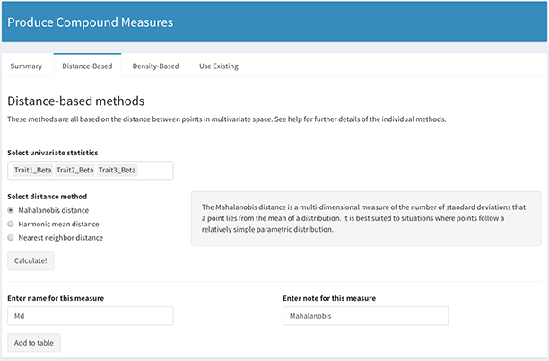


The same general options also appear under the 'Density-Based' tab, which is used to generate Kernel Density measurements. The user must also select a the 'Bandwidth estimation method' used to calculate the kernel size. Options include using an appropriate bandwidth for the data based on Silverman's rule (default), setting a custom bandwidth, and using maximum likelihood to determine the optimal bandwidth to use (much more time consuming). For this dataset the maximum likelihood estimate of the best bandwidth is 0.01, so we will set a custom bandwidth with that value.

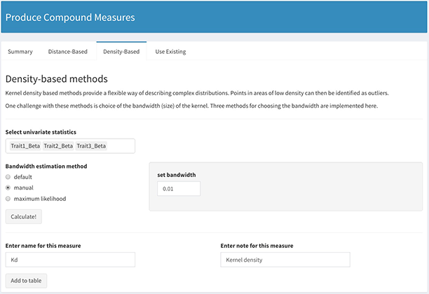


Between each, the user will notice that the summary table reporting multivariate measures will be populated. Users can use the menu near the bottom of the 'Summary' tab to both replot histograms and delete any generated multivariate measurements.


##### Visualizing Multivariate Distributions & Outliers

Finally, now that multivariate measures have been calculated, the user can proceed to generating plots and visually exploring the data. NOTE: The user can also visualize their data before calculating multivariate measures. If a user has calculated multivariate measures outside of the GUI, he or she can pass them directly to the plotting pages by loading a dataset with the multivariate measures as columns (i.e., calculated multivariate measures appended to the end of the raw dataframe).

The submenus beneath **Produce Plots** include the plot type available in MINOTAUR. To demonstrate the general options available to the user when plotting, we will create a Manhattan plot of our multivariate measures using the *Linear Manhattan Plot* submenu.

Each plotting submenu contains two options menus and the resulting plot. The 'Select Variables' menu is used to manipulate what data are being plotted on each axis, plus intuitive, general attributes about the axes themselves. Under 'Select y-axis' we will select the output of our Nearest Neighbor Distance calculation (called 'Nd') to display a Manhattan plot of this distance across all loci in the dataset.

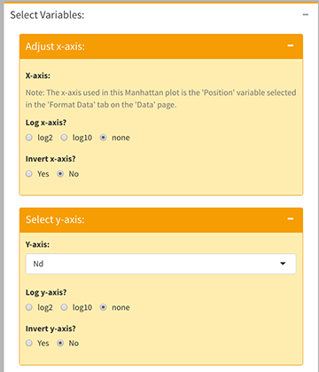


The 'Select outlier variable' gives us the ability to color points based on their position in the variable distribution (i.e., color outliers). In this circumstance, it makes the most sense to color the highest (upper) 1% tail of the Nearest Neighbor Distance, which represents those loci whose multivariate nearest neighbor distance distance is the greatest.

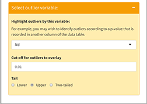


The 'Adjust Plot Aesthetics' menu provides numerous, intutive aesthetic options for the resulting plot. Here is a menu configuration that provides an intuitive Manhattan plot with outliers indicated by red dots.


And here is the resulting plot based on these options.

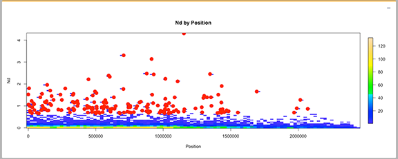


Part of the beauty of the MINOTAUR GUI is that multiple, stacked plots can be made, and when the plotting menus are collapsed, it provides the user with the ability to visually compare how various univariate and multivariate measures performed with the data, resulting in a figure like the following.

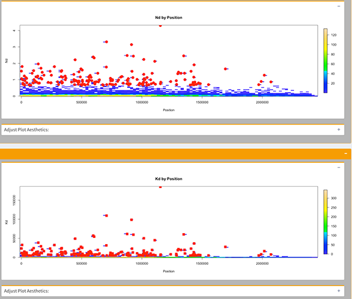


Users will see these general plotting options on the other plotting submenus and can use them to generate an array of plots that are useful for exploring their data.

## Reporting Issues
We encourage users to report issues or make feature requests using [GitHub Issues](https://github.com/NESCent/MINOTAUR/issues/new). Known issues, which we are working to remedy, are included below.

1. Once a dataset has been loaded and used for subsequent formatting, outlier detection, and/or plotting, users will receive error messages if they attempt to change to a new dataset. If a user desires to begin a working with a new dataset, he or she should start a new instance of the MINOTAUR GUI to do so without issues.

## Acknowledgements
This work was conceived during a hackathon on Population Genetics in R, sponsored and hosted by the National Evolutionary Synthesis Center (NESCent) in March of 2015. The MINOTAUR team is grateful to fellow hackathon participants who gave valuable feedback during initial development of this project at NESCent and afterwards. We are also indebted to those at NESCent who made the event possible and especially to Hilmar Lapp, who organized and led the collective effort.

## Bibliography
- Lotterhos, K. E., Card, D. C., Schaal, S. M., Wang, L., Collins, C., & Verity, B. (2017) Composite measures of selection can improve the signal-to-noise ration in genome scans. *Methods in Ecology and Evolution*. In Press.
- Ma, Y., Ding, X., Qanbari, S., Weigend, S., Zhang, Q., & Simianer, H. (2015) Properties of different selection signature statistics and a new strategy for combining them. *Heredity*, 115, 426-436. [doi:10.1038/hdy.2015.42](https://dx.doi.org/10.1038/hdy.2015.42)
- Randhawa, I. A. S., Khatkar, M. S., Thomson, P. C., & Raadsma, H. W. (2014) Composite selection signals can localize the trait specific genomic regions in multi-breed populations of cattle and sheep. *BMC Genetics*, 15(1), 1. [doi:10.1186/1471-2156-15-34](https://dx.doi.org/10.1186/1471-2156-15-34)
- Randhawa, I. A., Khatkar, M. S., Thomson, P. C., & Raadsma, H. W. (2015) Composite selection signals for complex traits exemplified through bovine stature using multibreed cohorts of European and African Bos taurus. *G3: Genes| Genomes| Genetics*, 5(7), 1391-1401. [doi:10.1534/g3.115.017772](https://dx.doi.org/10.1534/g3.115.017772)
- Verity, R., Collins, C., Card, D.C., Schaal, S.M., Wang, L, & Lotterhos, K.E. (2017) MINOTAUR: A platform for the analysis and visualization of multivariate results from genome scans with R Shiny. *Molecular Ecology Resources* 17(1): 33-43. [doi:10.1111/1755-0998.12579](https://dx.doi.org/10.1111/1755-0998.12579)
